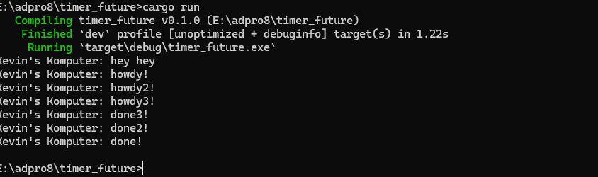
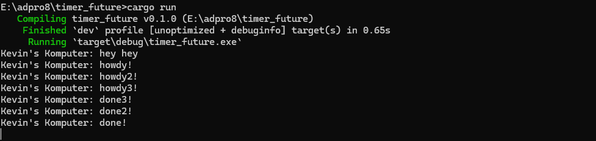

# Kevin Yehezkiel Manurung - 2206826974

### 1.2. Understanding how it works.

Meskipun `println!()` dituliskan setelah baris `spawner.spawn(async { ... });`, output berupa string "hey hey" muncul lebih dulu dibandingkan "howdy!". Hal ini terjadi karena blok async berjalan secara asinkron, di luar alur eksekusi utama. Artinya, program utama tidak menunggu penyelesaian task async tersebut. Pernyataan println!("hey hey") berada di luar blok async sehingga langsung dieksekusi oleh thread utama, sedangkan task async harus dijadwalkan dan dijalankan oleh executor. Akibatnya, "hey hey" tercetak lebih dahulu sebelum "howdy!" dari task async dieksekusi.

### 1.3: Multiple Spawn and removing drop

Hal ini terjadi karena ketiga task berjalan secara konkuren. Mereka dijalankan secara bersamaan tanpa saling menunggu, sehingga urutan penyelesaiannya tidak selalu sesuai dengan urutan penulisan dalam kode. Tidak ada jaminan bahwa task akan selesai sesuai dengan urutan tersebut.

Pemanggilan drop(spawner) diperlukan untuk memberi sinyal bahwa kita telah selesai menggunakan spawner. Spawner berfungsi layaknya message queue, di mana setiap task yang di-spawn akan dimasukkan ke dalam antrean. Saat executor mulai berjalan, ia akan mengambil task dari antrean tersebut. Dengan memanggil drop(spawner), kita memberi tahu bahwa tidak ada lagi task yang akan dikirim, sehingga executor dapat menyelesaikan semua task yang tersisa dan kemudian mengakhiri program.
