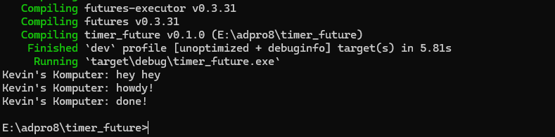

# Kevin Yehezkiel Manurung - 2206826974

### 1.2. Understanding how it works.

Meskipun `println!()` dituliskan setelah baris `spawner.spawn(async { ... });`, output berupa string "hey hey" muncul lebih dulu dibandingkan "howdy!". Hal ini terjadi karena blok async berjalan secara asinkron, di luar alur eksekusi utama. Artinya, program utama tidak menunggu penyelesaian task async tersebut. Pernyataan println!("hey hey") berada di luar blok async sehingga langsung dieksekusi oleh thread utama, sedangkan task async harus dijadwalkan dan dijalankan oleh executor. Akibatnya, "hey hey" tercetak lebih dahulu sebelum "howdy!" dari task async dieksekusi.